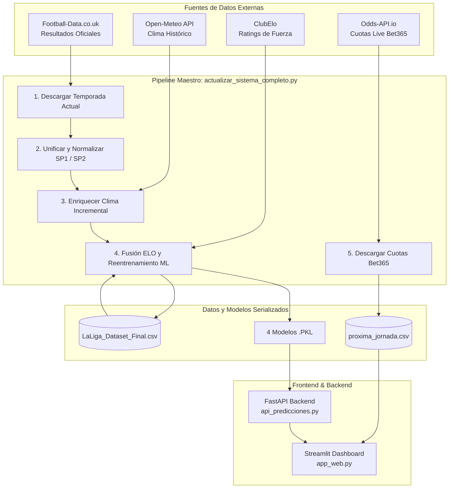

# ⚽ LaKiniela: Sistema de Trading Deportivo e Inteligencia Artificial

[](https://www.python.org/)
[](https://fastapi.tiangolo.com/)
[](https://streamlit.io/)
[](https://xgboost.readthedocs.io/)
[](https://scikit-learn.org/)
[](https://opensource.org/licenses/MIT)

**LaKiniela** es una plataforma integral de **MLOps, Data Science y Trading Deportivo** diseñada para predecir resultados del fútbol profesional español (Primera y Segunda División) y detectar de forma automática oportunidades de inversión (**Value Bets**) comparando las probabilidades calculadas por Inteligencia Artificial con las cuotas reales de **Bet365** en tiempo real.

---

## 📌 Tabla de Contenidos

- [✨ Características Principales](#-características-principales)
- [🤖 Modelos de Machine Learning](#-modelos-de-machine-learning)
- [🏗️ Arquitectura del Sistema](#️-arquitectura-del-sistema)
- [📂 Estructura del Repositorio](#-estructura-del-repositorio)
- [⚙️ Requisitos e Instalación](#️-requisitos-e-instalación)
- [🚀 Guía de Uso (1 solo clic)](#-guía-de-uso-1-solo-clic)
- [🌐 Fuentes de Datos Integradas](#-fuentes-de-datos-integradas)
- [🛡️ Diccionario Traductor Canónico](#️-diccionario-traductor-canónico)

---

## ✨ Características Principales

* **💎 Radar Automático de Value Bets:** Conexión en vivo con *Odds-API.io* para extraer cuotas reales de Bet365, compararlas con las estimaciones de la IA y señalar automáticamente las apuestas con ventaja matemática positiva ($P_{\text{IA}} > P_{\text{Casa}} + \text{Margen}$).
* **🤖 4 Mercados Predictivos Simultáneos:** Inferencia probabilística en 1X2, Más/Menos 2.5 Goles, Ambos Equipos Marcan (BTTS) y Más/Menos 9.5 Córners.
* **⏱️ Tracker In-Play & Live Sniper:** Simulador de evolución de cuotas en directo según el minuto de juego, marcador y tarjetas rojas, con cálculo de *Expected Value* ($EV\%$), curva de valor con Plotly y semáforo de entrada óptima.
* **🔄 Pipeline ETL 100% Automatizado:** Descarga semanal de resultados oficiales, unificación de históricos, enriquecimiento de clima por coordenadas de estadios, cálculo de clasificaciones ELO y reentrenamiento de modelos en 1 solo comando.
* **🗺️ Mapeo Inteligente (+240 Variantes):** Traductor canónico en JSON (`mapeo_equipos.json`) que resuelve discrepancias en nombres de equipos entre APIs externas, Football-Data, ClubElo y Open-Meteo.
* **📊 Dashboard Analítico Interactivo:** Interfaz visual construida con Streamlit y Plotly para inspeccionar el factor cancha desde el año 2000, evolución del ELO, medias de córners y correlación del clima con el rendimiento.


---

## 🤖 Modelos de Machine Learning

El sistema entrena y serializa 4 modelos optimizados con datos históricos consolidados (casi 18.000 partidos):

| Mercado | Algoritmo | Objetivo | Variables Predictivas |
| :--- | :--- | :--- | :--- |
| **1X2 (Resultado Final)** | `XGBClassifier` (Multiclase) | Victoria Local / Empate / Victoria Visitante | `elo_local`, `elo_visitante`, `dif_elo`, `B365H`, `B365D`, `B365A` |
| **Goles (+/- 2.5)** | `RandomForestClassifier` | Probabilidad de Más de 2.5 Goles | `elo_local`, `elo_visitante`, `dif_elo`, `B365H`, `B365D`, `B365A` |
| **Ambos Marcan (BTTS)** | `RandomForestClassifier` | Probabilidad de Ambos Equipos Marcan (Sí/No) | `elo_local`, `elo_visitante`, `dif_elo`, `B365H`, `B365D`, `B365A` |
| **Córners (+/- 9.5)** | `RandomForestClassifier` | Probabilidad de Más de 9.5 Córners | `elo_local`, `elo_visitante`, `dif_elo`, `B365H`, `B365D`, `B365A` |

---

## 🏗️ Arquitectura del Sistema



---

## 📂 Estructura del Repositorio

```
LaKiniela/
├── actualizar_sistema_completo.py   # 🔄 Pipeline maestro de ETL, Clima, ELO, Modelos y Cuotas
├── api_predicciones.py              # ⚡ Servidor REST FastAPI (Endpoint POST /predecir)
├── app_web.py                       # 📊 Dashboard interactivo de Streamlit
├── descargar_cuotas_live.py         # 🌐 Módulo de descarga y mapeo de cuotas Bet365
├── entrenar_modelos.py              # 🤖 Script de reentrenamiento directo de los 4 modelos
├── auditor_equipos.py               # 🔍 Auditor de coordenadas geográficas de estadios
│
├── mapeo_equipos.json               # 🗺️ Diccionario oficial de mapeo canónico de clubes
├── coordenadas_equipos.csv          # 📍 Latitud y longitud de los estadios
├── LaLiga_Dataset_Final.csv         # 📈 Dataset maestro consolidado y enriquecido
├── proxima_jornada.csv              # 📅 Partidos, fechas y cuotas en vivo de la jornada
│
├── modelo_1x2_xgboost.pkl           # 🧠 Modelo serializado 1X2
├── modelo_goles_rf.pkl              # 🧠 Modelo serializado Goles (+/- 2.5)
├── modelo_btts_rf.pkl               # 🧠 Modelo serializado Ambos Marcan
├── modelo_corners_rf.pkl            # 🧠 Modelo serializado Córners (+/- 9.5)
├── label_encoder.pkl                # 🏷️ LabelEncoder de clases 1X2
│
├── SP1/                             # 📁 CSVs por temporada de Primera División
├── SP2/                             # 📁 CSVs por temporada de Segunda División
│
├── iniciar_lakiniela_completo.bat   # 🌟 Lanzador TODO-EN-UNO (Sincroniza, entrena y abre web)
├── actualizar_todo.bat              # 🔄 Sincroniza datos históricos y reentrena modelos
├── jornada_actual.bat               # ⚽ Levanta la API y abre el Dashboard web existente
├── respaldo_datos.bat               # 💾 Script de backup de datos
├── requirements.txt                 # 📦 Dependencias de Python
└── README.md                        # 📖 Documentación del proyecto
```

---

## ⚙️ Requisitos e Instalación

### 1. Clonar el repositorio
```bash
git clone https://github.com/pakogarcia/LaKiniela.git
cd LaKiniela
```

### 2. Crear y activar el entorno virtual
```bash
python -m venv env_futbol
# En Windows:
env_futbol\Scripts\activate
```

### 3. Instalar las dependencias
```bash
pip install -r requirements.txt
```

### 4. Configurar la clave de la API de cuotas
Crea un archivo `.env` en la raíz del proyecto con tu clave de [Odds-API.io](https://odds-api.io/):
```env
THE_ODDS_API_KEY=tu_clave_aqui
```

---

## 🚀 Guía de Uso (1 solo clic)

Para mayor comodidad en Windows, el proyecto cuenta con scripts `.bat` automatizados:

| Archivo Batch | Función | ¿Cuándo utilizarlo? |
| :--- | :--- | :--- |
| **`iniciar_lakiniela_completo.bat`** *(Recomendado)* | **Hace TODO en 1 clic**: actualiza resultados, clima y ELO, reentrena los 4 modelos de IA, descarga las cuotas en vivo de Bet365, levanta FastAPI y abre el Dashboard en el navegador. | Al empezar a analizar una nueva jornada. |
| **`actualizar_todo.bat`** | Sincroniza el histórico, enriquece datos y reentrena los modelos sin abrir la interfaz gráfica. | Tras finalizar los partidos del fin de semana. |
| **`jornada_actual.bat`** | Levanta la API y abre directamente el Dashboard web con los datos ya existentes. | Para consultar predicciones sin volver a descargar datos. |

---

## 🌐 Fuentes de Datos Integradas

* **[Football-Data.co.uk](https://www.football-data.co.uk/):** Resultados históricos, estadísticas de partido (goles, tiros, faltas, córners, tarjetas) y cuotas históricas de Bet365.
* **[Odds-API.io](https://odds-api.io/):** Cuotas en tiempo real de Bet365 para partidos de Primera y Segunda División de España.
* **[Open-Meteo](https://open-meteo.com/):** Variables climáticas históricas (temperatura máxima, precipitaciones y velocidad del viento) en las coordenadas del estadio local.
* **[ClubElo](http://clubelo.com/):** Sistema de ratings ELO para evaluar la fuerza relativa y actualizada de cada club.

---

## 🛡️ Diccionario Traductor Canónico

Para evitar discrepancias entre diferentes proveedores (por ejemplo: *"Real Betis Seville"*, *"Real Betis Balompié"*, *"Betis"* o *"Atlético de Madrid"*, *"Athletic Club"*), el archivo [mapeo_equipos.json](mapeo_equipos.json) actúa como fuente única de verdad con más de **240 variantes normalizadas** hacia los nombres canónicos de la base de datos.

---

## 👤 Autor

Desarrollado por **Pako García** - [GitHub @pakogarcia](https://github.com/pakogarcia)

